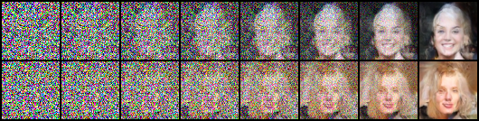

# Flow Matching for CelebA

A minimal flow matching implementation that learns a velocity field for transforming Gaussian noise into `64x64` CelebA face images. The model uses a U-Net, and the ODE is solved with the Euler method.



## Main Files

- `unet.py`: U-Net that predicts the time-dependent velocity field.
- `train.py`: trains the flow matching model and saves a checkpoint.
- `sample.py`: generates an image grid from a checkpoint.
- `sample_trajectory.py`: saves intermediate states from the generation process.
- `config.py`: training and sampling hyperparameters.

## Installation

```bash
python -m venv .venv
source .venv/bin/activate
pip install -r requirements.txt
```

## Preparing the Dataset

Place `.jpg`, `.jpeg`, `.png`, or `.webp` images directly in the `data/` directory. The dataset loader expects a flat directory, center-crops each image, resizes it to `64x64`, and normalizes pixel values to `[-1, 1]`.

## Training

```bash
python train.py
```

The checkpoint and generated samples are saved in `runs/celeba_flow/`. The default settings use `10,000` training steps, a batch size of `64`, a learning rate of `2e-4`, and `100` Euler steps during sampling.

## Generating Images

After `runs/celeba_flow/model_final.pt` has been created, run:

```bash
python sample.py
```

The result is saved to `runs/celeba_flow/test_samples.png`.

## Generating Trajectories

```bash
python sample_trajectory.py
```

This command generates `2` samples, saves `8` frames per trajectory, and writes the result to `runs/celeba_flow/trajectory.png`.

## Notes

- You can configure the dataset, image size, number of steps, and device in `config.py`.
- CUDA is used automatically when available; otherwise, the code runs on the CPU.
- Checkpoints and generated outputs in `runs/` are ignored by Git. The image used in this README is stored separately at `assets/trajectory.png`.